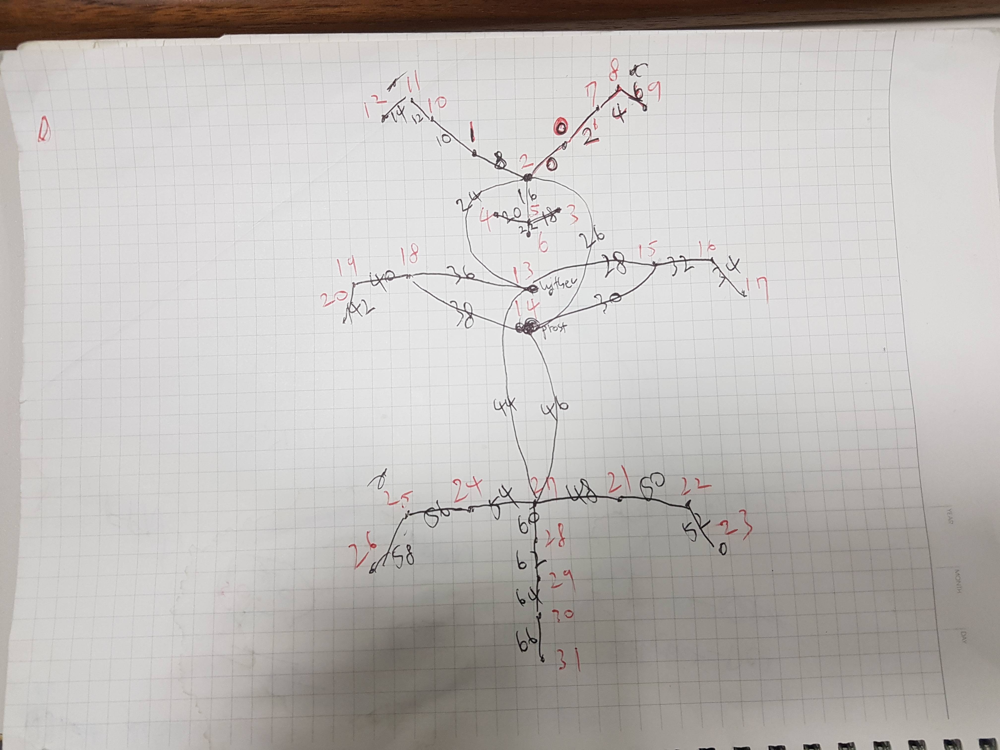

## 해당 repository를 통해 개의 신체 자세를 추정하는 모델을 만들었다.
<https://github.com/ildoonet/tf-pose-estimation.git>

## 그리고 해당 블로그에서 openpose 동작 원리에 대해 많이 공부할 수 있었다. (사람의 자세 추정을 목표로 구현된 소스로 강아지 자세를 추정하려면 신체포인트가 달라서 많은 수정을 해야 한다)
<https://arvrjourney.com/human-pose-estimation-using-openpose-with-tensorflow-part-2-e78ab9104fc8>

본래 Openpose는 human pose를 추론하는 알고리즘이다. CMU의 오리지날 논문 구현에서는 Caffe를 사용했지만, 해당 프로젝트에서는 텐서플로를 이용해 구현하였다.

---

### Requirements
* python3
* tensorflow 1.4.1+
* opencv3, protobuf, python3-tk
* slidingwindow

### Install
1. 해당 repository를 받는다.
2. pip install -r requirements.txt 를 통해 필요한 패키지를 설치한다
3. tf_pose/pafprocess 로 이동한다
4. swig -python -c++ pafprocess.i && python3 setup.py build_ext --inplace 로 c++ 코드를 python으로 치환해 준다.


해당 구현의 경우 인간 자세 Coco dataset의 keypoint 라벨링에 맞게 트레이닝을 하고 추론이 되도록 되어있다. 따라서 인간의 keypoint 개수와 keypoint pair를 강아지에 맞개 개수를 변경해줘야 한다. 또한 repository가 관리된지 조금 오래 지나서 commit이 이루어 지지 않고 다른 버전의 tensorflow와 cuda version에서 동작이 안되는 부분이 있어서 부분부분 수정이 필요하다.


수정해야하는 부분을 지금부터 명시하겠다.


coco dataset의 인간의 키포인트는 총 18개이다.(background까지 하면 19개).
내가 정의해준 강아지의 신체포인트는 총 32개이다.(background까지 하면 33개)

## 손으로 먼저 강아지 자세 컨버팅을 진행하였다. 윗부분이 귀/얼굴이고 가장 아래가 꼬리다(점 5개)


---

인간 신체포인트를 강아지 신체포인트로 컨버팅하기 위하여 수정해야하는 부분을 지금부터 명시하겠다.

```
# common.py

LEye = 0
REye = 1
Nose = 2
LMouth = 3
RMouth = 4
MouthRow = 5
Tongue = 6
LEarStart = 7
LEarMiddle = 8
LEarEnd = 9
REarStart = 10
REarMiddle = 11
REarEnd = 12
Withers = 13
Prosternum = 14
LElbow = 15
LForearm = 16
LForefoot = 17
RElbow = 18
RForearm = 19
RForefoot = 20
LStiffle = 21
LHock = 22
LHindfoot = 23
RStiffle = 24
RHock = 25
RHindfoot = 26
TailStart = 27
TailStartMiddle = 28
TailMiddle = 29
TailMiddleEnd = 30
TailEnd = 31
Background = 32

# 신체 포인트를 이어주는 pair는 다음과 같다. CocoPairRender는 모두 표시해주고 싶어서 원래 있던 [:-2]를 제외하였다.

CocoPairs = [
    (2, 0), (0, 7), (7, 8), (8, 9), (2, 1), (1, 10), (10, 11), (11, 12), (2, 5), (5, 3),
    (5, 4), (5, 6), (2, 13), (2, 14), (13, 15), (14, 15), (15, 16), (16, 17), (13, 18), (14, 18),
    (18, 19), (19, 20), (13, 27), (14, 27), (27, 21), (21, 22), (22, 23), (27, 24), (24, 25), (25, 26),
    (27, 28), (28, 29), (29, 30), (30, 31)
]   # = 34
CocoPairsRender = CocoPairs

CocoColors = [[255, 0, 0], [255, 85, 0], [255, 170, 0], [255, 255, 0], [255, 255, 0], [255, 255, 0], [255, 255, 0],
              [170, 255, 0], [170, 255, 0], [170, 255, 0], [85, 255, 0], [85, 255, 0], [85, 255, 0],
              [0, 255, 0], [0, 255, 85], [0, 255, 170], [0, 255, 170], [0, 255, 170],
              [0, 255, 255], [0, 255, 255], [0, 255, 255], [0, 170, 255], [0, 170, 255], [0, 170, 255],
              [0, 85, 255], [0, 85, 255], [0, 85, 255],
              [0, 0, 255], [0, 0, 255], [0, 0, 255], [0, 0, 255], [0, 0, 255], [85, 0, 255], [170, 0, 255]]

```
```
# estimator.py

# 머리 박스 쳐주는 것을 강아지 신체포인트에 맞게 변경
def get_face_box(self, img_w, img_h, mode=0):
    _NOSE = CocoPart.Nose.value
    _NECK = CocoPart.MouthRow.value
    _REye = CocoPart.REye.value
    _LEye = CocoPart.LEye.value
    _REar = CocoPart.REarEnd.value
    _LEar = CocoPart.LEarEnd.value

# 부분부분 숫자가 18로 되어있는 것들을 32로 바꿔줘야 한다. 사람 신체포인트는 18개, 그리고 정의한 강아지 신체포인트는 32개이기 때문.
for part_idx in range(32):

# 그리고 heatMat과 pafMat 부분이 19로 되어있는데 해당 부분은 34로 변경해준다
self.tensor_heatMat = self.tensor_output[:, :, :, :34]
self.tensor_pafMat = self.tensor_output[:, :, :, 34:]
self.upsample_size = tf.placeholder(dtype=tf.int32, shape=(2,), name='upsample_size')
self.tensor_heatMat_up = tf.image.resize_area(self.tensor_output[:, :, :, :34], self.upsample_size,
                                                      align_corners=False, name='upsample_heatmat')
self.tensor_pafMat_up = tf.image.resize_area(self.tensor_output[:, :, :, 34:], self.upsample_size,
                                                     align_corners=False, name='upsample_pafmat')
if trt_bool is True:
    smoother = Smoother({'data': self.tensor_heatMat_up}, 25, 3.0, 34)
else:
    smoother = Smoother({'data': self.tensor_heatMat_up}, 25, 3.0)
```
```
# network_mobilenet_v2.py
# 프로젝트 진행에서 backbone 모델은 가장 만만한 mobilenet_v2를 이용하였다. 해당 부분 또한 신체포인트 개수가 다르기에 노드의 개수를 변경해 줘야 한다.

# 38 -> 68으로
# 19 -> 34로
```
```
# pose_augment.py
트레이닝 시에 데이터 augmentation을 위해서 변경된 신체포인트를 명시해 주자. 일반적인 경우는 상관없지만 flip같은 경우에 신체포인트 좌우가 바뀌어야 한다

# flip meta
    flip_list = [CocoPart.REye, CocoPart.LEye, CocoPart.Nose, CocoPart.RMouth, CocoPart.LMouth, CocoPart.MouthRow, CocoPart.Tongue, CocoPart.REarStart,
                 CocoPart.REarMiddle, CocoPart.REarEnd, CocoPart.LEarStart, CocoPart.LEarMiddle, CocoPart.LEarEnd, CocoPart.Withers,
                 CocoPart.Prosternum, CocoPart.RElbow, CocoPart.RForearm, CocoPart.RForefoot, CocoPart.LElbow, CocoPart.LForearm, CocoPart.LForefoot,
                 CocoPart.RStiffle, CocoPart.RHock, CocoPart.RHindfoot, CocoPart.LStiffle, CocoPart.LHock, CocoPart.LHindfoot, CocoPart.TailStart,
                 CocoPart.TailStartMiddle, CocoPart.TailMiddle, CocoPart.TailMiddleEnd, CocoPart.TailEnd, CocoPart.Background]

```
```
# pose_dataset.py
__coco_parts = 34
__coco_vecs = list(zip(
        [3, 1, 8, 9,  3,  2, 11, 12, 3, 6, 6, 6,  3,  3, 14, 15, 16, 17, 14, 15, 19, 20, 14, 15, 28, 22, 23, 28, 25, 26, 28, 29, 30, 31],
        [1, 8, 9, 10, 2, 11, 12, 13, 6, 4, 5, 7, 14, 15, 16, 16, 17, 18, 19, 19, 20, 21, 28, 28, 22, 23, 24, 25, 26, 27, 29, 30, 31, 32]
    ))

transform = list(zip(
            [1, 2, 3, 4, 5, 6, 7, 8, 9, 10, 11, 12, 13, 14, 15, 16, 17, 18, 19, 20, 21, 22, 23, 24, 25, 26, 27, 28, 29, 30, 31, 32],
            [1, 2, 3, 4, 5, 6, 7, 8, 9, 10, 11, 12, 13, 14, 15, 16, 17, 18, 19, 20, 21, 22, 23, 24, 25, 26, 27, 28, 29, 30, 31, 32]
        ))

# 여기서 기본으로 제공되는 데이터셋이 아닌 커스텀 데이터셋 명시해줌
if is_train:
    whole_path = os.path.join(path, 'train.json')
else:
    whole_path = os.path.join(path, 'test.json')
    self.img_path = (img_path if img_path is not None else '') + ('/train/' if is_train else '/test/')

# tensorflow 버전에 따라서 수정해줘야 하는 경우도 있음
ds = MultiThreadMapData(ds, num_thread=16, map_func=read_image_url, buffer_size=1000)
```
```
# train.py

# vectmap_node의 기존 38 -> 68로, heatmap_node는 기존 19 -> 34로
vectmap_node = tf.placeholder(tf.float32, shape=(args.batchsize, output_h, output_w, 68), name='vectmap')
heatmap_node = tf.placeholder(tf.float32, shape=(args.batchsize, output_h, output_w, 34), name='heatmap')

그리고 트레이닝이 일정부분 지속 된 후 validation을 해주는 부분이 있다. 여기서 아마 계속 오류가 발생할 것이다. df_valid.reset_state() 시점에서 에러가 날것이다. 그냥 맘 편하게 세션이 시작하기 전에 validation 이미지들을 메모리에 올려놓는 것이 정신건강에 이롭다.

# 해당 코드를 with tf.Session(config=config) as sess: 위로 올려놓자. 그러면 밑에서 validation_cache가 존재하기 때문에 다시 불러오려고 노력하지 않는다.
for images_test, heatmaps, vectmaps in tqdm(df_valid.get_data()):
        validation_cache.append((images_test, heatmaps, vectmaps))
del df_valid
df_valid = None

pafMat, heatMat = outputMat[:, :, :, 34:], outputMat[:, :, :, :34]
```

---

거의 다 왔다. 그리고 openpose 논문을 보면 알겠지만 각 지점의 추정 히트맵 부분을 연결해주는 것이 필요하다. 해당 부분은 속도 때문인지 python으로 구현하지 않고 c++ 코드로 구현이 되어있다. 신체포인트와 페어의 개수가 다르므로 이 부분 또한 변경을 해줘야 한다.

tf_pose/pafprocess (해당 부분을 수정 후에는 swig를 통해 build를 다시 해줘야 한다) 에 존재하는 파일들을 수정해주자

---


```
# pafprocess.cpp
if (found == 1) {
    if (subset[subset_idx1][part_id2] != conns[conn_id].cid2) {
    subset[subset_idx1][part_id2] = conns[conn_id].cid2;
    subset[subset_idx1][33] += 1;
    subset[subset_idx1][32] += peak_infos_line[conns[conn_id].cid2].score + conns[conn_id].score;
    }
} else if (found == 2) {
    int membership=0;
    for (int subset_id = 0; subset_id < 32; subset_id ++) {
        if (subset[subset_idx1][subset_id] > 0 && subset[subset_idx2][subset_id] > 0) {
            membership = 2;
        }
    }

    if (membership == 0) {
        for (int subset_id = 0; subset_id < 32; subset_id ++) subset[subset_idx1][subset_id] += (subset[subset_idx2][subset_id] + 1);

            subset[subset_idx1][33] += subset[subset_idx2][33];
            subset[subset_idx1][32] += subset[subset_idx2][32];
            subset[subset_idx1][32] += conns[conn_id].score;
            subset.erase(subset.begin() + subset_idx2);
        } else {
            subset[subset_idx1][part_id2] = conns[conn_id].cid2;
            subset[subset_idx1][33] += 1;
            subset[subset_idx1][32] += peak_infos_line[conns[conn_id].cid2].score + conns[conn_id].score;
        }
} else if (found == 0) {
    vector<float> row(34);
    for (int i = 0; i < 34; i ++) row[i] = -1;
    row[part_id1] = conns[conn_id].cid1;
    row[part_id2] = conns[conn_id].cid2;
    row[33] = 2;
    row[32] = peak_infos_line[conns[conn_id].cid1].score + peak_infos_line[conns[conn_id].cid2].score + conns[conn_id].score;
    subset.push_back(row);
}


float get_score(int human_id) {
    return subset[human_id][32] / subset[human_id][33];
}
```
```
# pafprocess.h
const float THRESH_HUMAN_SCORE = 0.1;
const int NUM_PART = 32;

const int STEP_PAF = 10;

const int COCOPAIRS_SIZE = 34;
const int COCOPAIRS_NET[COCOPAIRS_SIZE][2] = {
    {0, 1}, {2, 3}, {4, 5}, {6, 7}, {8, 9}, {10, 11}, {12, 13}, {14, 15}, {16, 17}, {18, 19},
    {20, 21}, {22, 23}, {24, 25}, {26, 27}, {28, 29}, {30, 31}, {32, 33}, {34, 35}, {36, 37}, {38, 39},
    {40, 41}, {42, 43}, {44, 45}, {46, 47}, {48, 49}, {50, 51}, {52, 53}, {54, 55}, {56, 57}, {58, 59},
    {60, 61}, {62, 63}, {64, 65}, {66, 67}
};

const int COCOPAIRS[COCOPAIRS_SIZE][2] = {
    {2, 0}, {0, 7}, {7, 8}, {8, 9}, {2, 1}, {1, 10}, {10, 11}, {11, 12}, {2, 5}, {5, 3},
    {5, 4}, {5, 6}, {2, 13}, {2, 14}, {13, 15}, {14, 15}, {15, 16}, {16, 17}, {13, 18}, {14, 18},
    {18, 19}, {19, 20}, {13, 27}, {14, 27}, {27, 21}, {21, 22}, {22, 23}, {27, 24}, {24, 25}, {25, 26},
    {27, 28}, {28, 29}, {29, 30}, {30, 31}
};
```

---

여기까지가 수정을 해줘야하는 소스코드 부분이었다.

## 그리고 Custom Dataset을 COCO Dataset 형태로 컨터팅해서 트레이닝 할 준비를 하자. 해당 코드는 다음과 같다.

```python
import os
import fnmatch
import pandas as pd
import math
import json

base_folder = '/home/eastrain/tf-pose/data/point_data'
train_data = base_folder + '/train'
test_data = base_folder  + '/test'

train_json_file = base_folder + '/annotations/train.json'
test_json_file  = base_folder + '/annotations/test.json'

key_points = [
    'eye-left-open',
    'eye-left-close',
    'eye-right-open',
    'eye-right-close',
    'nose',
    'mouth-left',
    'mouth-right',
    'mouth-low',
    'tongue',
    'ear-left-start',
    'ear-left-middle',
    'ear-left-end',
    'ear-right-start',
    'ear-right-middle',
    'ear-right-end',
    'withers',
    'prosternum',
    'elbow-left',
    'forearm-left',
    'forefoot-left',
    'elbow-right',
    'forearm-right',
    'forefoot-right',
    'stiffle-left',
    'hock-left',
    'hindfoot-left',
    'stiffle-right',
    'hock-right',
    'hindfoot-right',
    'tail-start',
    'tail-start-middle',
    'tail-middle',
    'tail-middle-end',
    'tail-end'
]

def get_all_csv_files(path):
    csv_files = []
    for (path, directory, files) in os.walk(path):
        for filename in files:
            file_abs_path = os.path.join(path, filename)
            if fnmatch.fnmatch(filename, "*-p.csv"):
                csv_files.append(str(file_abs_path))
    return  csv_files

def make_json_file(filename, json_data):
    with open(filename, 'w', encoding='UTF8') as fp:
        json.dump(json_data, fp, ensure_ascii=False)

def make_base_json():
    return {
        "images": [],
        "annotations": [],
        "categories": [
            {
                "supercategory": "dog",
                "id": 1,
                "name": "dog",
                "keypoints": [
                    "eye-left",
                    "eye-right"
                ] + key_points[4:],
            }
        ]
    
}

def make_eye_point(csv, dog_idx, keypoints):
    num_keypoints = 0
    #### Eye Left ####
    eye_left_exist = False
    if not pd.isnull(csv[1][dog_idx]):
        keypoints[0] = int(csv[1][dog_idx])
        eye_left_exist = True
    elif not pd.isnull(csv[3][dog_idx]):
        keypoints[0] = int(csv[3][dog_idx])
        eye_left_exist = True
            
    if not pd.isnull(csv[2][dog_idx]):
        keypoints[1] = int(csv[2][dog_idx])
        eye_left_exist = True
    elif not pd.isnull(csv[4][dog_idx]):
        keypoints[1] = int(csv[4][dog_idx])
        eye_left_exist = True
                
    if eye_left_exist is True:
        keypoints[2] = 2
        num_keypoints = num_keypoints + 1
                
    #### Eye Right ####
    eye_right_exist = False
    if not pd.isnull(csv[5][dog_idx]):
        keypoints[3] = int(csv[5][dog_idx])
        eye_right_exist = True
    elif not pd.isnull(csv[7][dog_idx]):
        keypoints[3] = int(csv[7][dog_idx])
        eye_right_exist = True
            
    if not pd.isnull(csv[6][dog_idx]):
        keypoints[4] = int(csv[6][dog_idx])
        eye_right_exist = True
    elif not pd.isnull(csv[8][dog_idx]):
        keypoints[4] = int(csv[8][dog_idx])
        eye_right_exist = True
                
    if eye_right_exist is True:
        keypoints[5] = 2
        num_keypoints = num_keypoints + 1
        
    return num_keypoints

def get_pure_file_name(file_name):
    pure_file = os.path.basename(file_name)
    pure_file = pure_file.split('-p.csv')[0]

    if os.path.isfile(file_name.split(os.path.basename(file_name))[0] + pure_file + ".png"):
        return pure_file + ".png"
    elif os.path.isfile(file_name.split(os.path.basename(file_name))[0] + pure_file + ".jpg"):
        return pure_file + ".jpg"
    else:
        print("something wrong")
        print(file_name)

def make_coco_dataset(csv_files, json_file):
    cols = list(range(0, len(key_points)*2 + 1))
    for id, file in enumerate(csv_files):
        id = id + 1
        csv = pd.read_csv(file, header=None, usecols=cols, names=cols)
        image = {}
        image['file_name'] = get_pure_file_name(file)
        image['width'] = int(csv[1][0])
        image['height'] = int(csv[2][0])
        image['id'] = id
        json_file['images'].append(image)
        for idx in range(0, int(csv[3][0])):
            annotation = {}
            dog_idx = idx + 3
            keypoints = [0] * 96
            num_keypoints = make_eye_point(csv, dog_idx, keypoints)
            help_idx = 0
            
            for point_idx in range(9, len(cols)):
                point = csv[point_idx][dog_idx]
                keypoint_idx = point_idx-(3-math.floor(help_idx)) 
                if not pd.isnull(point):
                    keypoints[keypoint_idx] = int(point)
                    if help_idx-int(help_idx) == 0.5:
                        keypoints[keypoint_idx+1] = 2
                        num_keypoints = num_keypoints + 1
                help_idx = help_idx + 0.5
            
            annotation['num_keypoints'] = num_keypoints
            annotation['keypoints'] = keypoints
            annotation['image_id'] = id
            annotation['category_id'] = 1
            annotation['id'] = id + 999999
            json_file['annotations'].append(annotation)

train_json = make_base_json()
train_csv_files = get_all_csv_files(train_data)
make_coco_dataset(train_csv_files, train_json)
make_json_file(train_json_file, train_json)

test_json = make_base_json()
test_csv_files = get_all_csv_files(test_data)
make_coco_dataset(test_csv_files, test_json)
make_json_file(test_json_file, test_json)
```

---

## 데이터 셋이 준비되었으면 학습을 진행하고 검증한다.

```
$ python tf_pose/train.py --datapath=/home/eastrain/tf-pose/data/point_data/annotations --imgpath=/home/eastrain/tf-pose/data/point_data/ --batchsize=16 --gpus=2 --lr=0.0008 --tag=20200911
```


