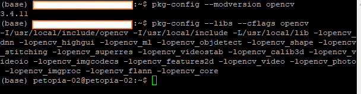
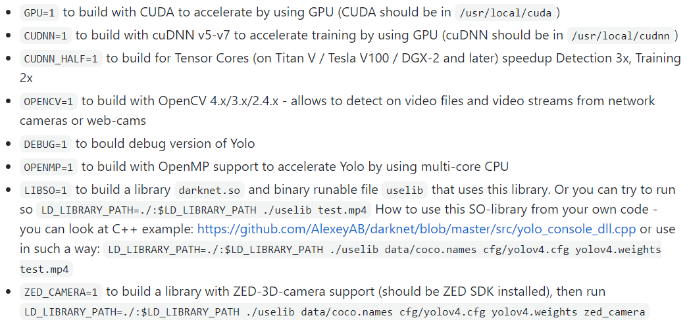

# 환경설정
Ubuntu 16.04 환경에서 작업하였다.

### Requirements
```
CMake >= 3.12

$ sudo apt install cmake
```
```
CUDA >= 10.0

network 형태로 설치(이 형태로 하면 패치를 받을 필요가 없어서 편하다)
$ wget https://developer.download.nvidia.com/compute/cuda/repos/ubuntu1604/x86_64/cuda-ubuntu1604.pin
$ sudo mv cuda-ubuntu1604.pin /etc/apt/preferences.d/cuda-repository-pin-600
$ sudo apt-key adv --fetch-keys http://developer.download.nvidia.com/compute/cuda/repos/ubuntu1604/x86_64/7fa2af80.pub
$ sudo add-apt-repository "deb http://developer.download.nvidia.com/compute/cuda/repos/ubuntu1604/x86_64/ /"
$ sudo apt-get update
$ sudo apt-get -y install cuda
```
```
OpenCV >= 2.4

$ sudo apt-get install build-essential cmake pkg-config libjpeg-dev libtiff5-dev libjasper-dev libpng12-dev libavcodec-dev libavformat-dev libswscale-dev libxvidcore-dev libx264-dev libxine2-dev libv4l-dev v4l-utils libgstreamer1.0-dev libgstreamer-plugins-base1.0-dev libqt4-dev mesa-utils libgl1-mesa-dri libqt4-opengl-dev libatlas-base-dev gfortran libeigen3-dev python2.7-dev python3-dev python-numpy python3-numpy
임시 폴더 생성
$ wget -O opencv.zip https://github.com/Itseez/opencv/archive/3.2.0.zip
$ unzip opencv.zip
$ wget -O opencv_contrib.zip https://github.com/Itseez/opencv_contrib/archive/3.2.0.zip
$ unzip opencv_contrib.zip
$ cd opencv-3.2.0
$ mkdir build
$ cd build
$ make -D CMAKE_BUILD_TYPE=RELEASE -D CMAKE_INSTALL_PREFIX=/usr/local -D WITH_TBB=OFF -D WITH_IPP=OFF -D WITH_1394=OFF -D BUILD_WITH_DEBUG_INFO=OFF -D BUILD_DOCS=OFF -D INSTALL_C_EXAMPLES=ON -D INSTALL_PYTHON_EXAMPLES=ON -D BUILD_EXAMPLES=OFF -D BUILD_TESTS=OFF -D BUILD_PERF_TESTS=OFF -D ENABLE_NEON=ON -D WITH_QT=ON -D WITH_OPENGL=ON -D OPENCV_EXTRA_MODULES_PATH=../../opencv_contrib-3.2.0/modules -D WITH_V4L=ON -D WITH_FFMPEG=ON -D WITH_XINE=ON -D BUILD_NEW_PYTHON_SUPPORT=ON -D PYTHON_INCLUDE_DIR=/usr/include/python2.7 -D PYTHON_INCLUDE_DIR2=/usr/include/x86_64-linux-gnu/python2.7 -D PYTHON_LIBRARY=/usr/lib/x86_64-linux-gnu/libpython2.7.so ../
$ make -j8 (cpu 코어 수에 따라서 숫자 조절)
$ sudo make install
설치확인
$ pkg-config --modversion opencv
$ pkg-config --libs --cflags opencv
```


```
cuDNN >= 7.0

1. https://developer.nvidia.com/cudnn 이동
2. Download cuDNN 클릭
3. Login
4. https://developer.nvidia.com/rdp/cudnn-archive 이동
5. Download cuDNN v7.6.5 (November 18th, 2019), for CUDA 10.2 선택
6. cuDNN Runtime Library for Ubuntu16.04 (Deb) 다운로드
7. sudo dpkg -i 다운받은deb파일
```

### darknet 설치
위의 requirements가 모두 설치되었다는 가정하에 진행한다.

* https://github.com/AlexeyAB/darknet.git 받고 해당 폴더 이동
* Makefile 열어서 수정(아래 그림 파일 참조)

본인의 경우에는 현재 PC의 상황에 맞게 다음과 같이 설정하였다.
```
GPU=1
CUDNN=1
CUDNN_HALF=0
OPENCV=1
AVX=0
OPENMP=0
LIBSO=1
ZED_CAMERA=0
ZED_CAMERA_v2_8=0
```
* $ make 명령어를 통해 컴파일
* 컴파일 도중 NVCC 에러가 날 수도 있다. 이때는 다시 Makefile을 열어서 본인의 nvcc 경로를 변경해줘야한다.
일반적으로 위에서 cuda를 제대로 설치했으면 /usr/local/cuda/bin/nvcc 일 것이다.
* ./darknet detector test ./cfg/coco.data ./cfg/yolov4.cfg ./yolov4.weights 명령어를 통해 올바르게 컴파일이 되었는지 확인을 해본다. 보통 makefile이나 실행 도중 에러가 나면 에러메시지를 잘 확인해 보길 바란다. cuda version 문제 또는 cudnn version문제 또는 opencv 관련 문제일 것이다.


