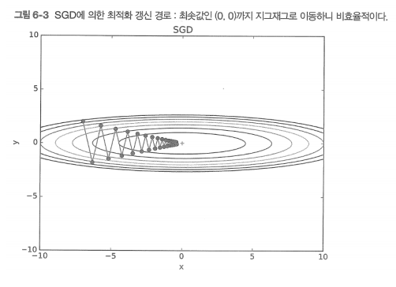

# 최적화 함수들(optimization)
신경망 학습의 목적은 손실 함수의 값을 가능한 한 낮추는 매개변수를 찾는 것이며, 이러한 문제를 푸는 것을 최적화(optimization)이라고 한다.

## 확률적 경사 하강법 - SGD(Stochastic Gradient Descent)
최적의 매개변수 값을 찾는 단서로 매개변수의 기울기(미분)을 이용. 매개변수의 기울기를 구해, 기울어진 방향으로 매개변수 값을 갱신하는 일을 계속 반복한다.

```
W <- W - ( learning rate * dL / dW )

W : 가중치
L : 손실 함수 
```

#### SGD의 단점



심하게 굽이진 움직임을 보여준다. 따라서 이러한 경우에는 조금 비효율 적이다.

## 모멘텀(Momentum)
```
v <- av - ( learning rate * dL / dW )
W <- W + v

W : 가중치
L : 손실함수
```

SGD와 차이점을 보면 av 값을 더해준게 눈에 띈다. 여기서 a는 고정된 상수값이고(ex 0.9) v는 물체의 속도라고 생각하면 된다.
해당 방향으로 진행할 수록 공이 기울기를 따라 구르듯 힘을 받는다.


모멘텀의 갱신 경로는 공이 그릇 바닥을 구르듯 움직인다. SGD와 비교했을 때 지그재그 정도가 덜한 것을 알 수 있다.


또한 Momentum 방식을 이용할 경우 위의 그림과 같이 local minima를 빠져나오는 효과가 있을 것이라고도 기대할 수 있다. 기존의 SGD를 이용할 경우 좌측의 local minima에 빠지면 gradient가 0이 되어 이동할 수가 없지만, momentum 방식의 경우 기존에 이동했던 방향에 관성이 있어 이 local minima를 빠져나오고 더 좋은 minima로 이동할 것을 기대할 수 있게 된다.

## AdaGrad

학습에서는 Learning Rate가 중요하다. 이 값이 너무 작으면 학습 시간이 너무 길어지고, 반대로 너무 크면 발산하여 학습이 제대로 이뤄지지 않는다.

이러한 학습률을 정하는 효과적 기술로 학습률 감소(learning rate decay)가 있다. 이는 학습을 진행하면서 학습률을 점차 줄여나가는 방법이다.

학습률을 서서히 낮추는 가장 간단한 방법은 전체 학습률 값을 일괄적으로 낮추는 것이지만, 이를 더 발전시킨 것이 AdaGrad이다. AdaGrad는 '각각의' 매개변수에 '맞춤형'값을 만들어준다.

AdaGrad는 개별 매개변수에 각각 다른 학습률을 적용해준다.


이 수식을 해석하면 매개변수의 원수 중에서 크게 갱신된 원소는 학습률이 낮아진다.


```
RMSProp
AdaGrad는 과거의 기울기를 제곱하여 계속 더해간다. 그래서 학습을 진행할수록 갱신 강도가 
약해지고 계속해서 학습하면 어느 순간 갱신량이 0이 되어 전혀 갱신되지가 않는다. 
이를 개선한 기법이 RMSProp이다. RMSProp은 과거의 모든 기울기를 균일하게 
더해가는 것이 아니라, 먼 과거의 기울기는 서서히 잊고 새로운 기울기 정보를 크게 반영한다.
```

## Adam
모멘텀 + AdaGrad
정확히 파고들면 다르지만, 직관적으로 해석하면 모멘텀과 AdaGrad를 융합한 듯한 방법이다.


## Optimizer 한눈으로 보기
<br>
*출처: 하용호, 자습해도 모르겠던 딥러닝, 머리속에 인스톨 시켜드립니다(https://www.slideshare.net/yongho/ss-79607172)*

## 어느 갱신 방법을 이용할 것인가?
상황마다 다르다. 풀어야 할 문제가 무엇이냐에 따라 달라지고, 하이퍼파라미터를 어떻게 설정하느냐에 따라서 적절한 optimizer가 다르다. 