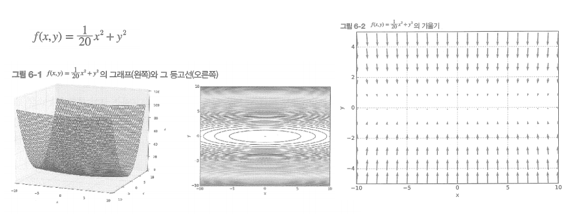

# 최적화 함수들(optimization)
신경망 학습의 목적은 손실 함수의 값을 가능한 한 낮추는 매개변수를 찾는 것이며, 이러한 문제를 푸는 것을 최적화(optimization)이라고 한다.

## 확률적 경사 하강법 - SGD(Stochastic Gradient Descent)
최적의 매개변수 값을 찾는 단서로 매개변수의 기울기(미분)을 이용. 매개변수의 기울기를 구해, 기울어진 방향으로 매개변수 값을 갱신하는 일을 계속 반복한다.

```
W <- W - ( learning rate * dL / dW )

W : 가중치
L : 손실 함수 
```

#### SGD의 단점



심하게 굽이진 움직임을 보여준다. 따라서 이러한 경우에는 조금 비효율 적이다.

## 모멘텀(Momentum)
```
v <- av - ( learning rate * dL / dW )
W <- W + v

W : 가중치
L : 손실함수
```

SGD와 차이점을 보면 av 값을 더해준게 눈에 띈다. 여기서 a는 고정된 상수값이고(ex 0.9) v는 물체의 속도라고 생각하면 된다.
해당 방향으로 진행할 수록 공이 기울기를 따라 구르듯 힘을 받는다.


