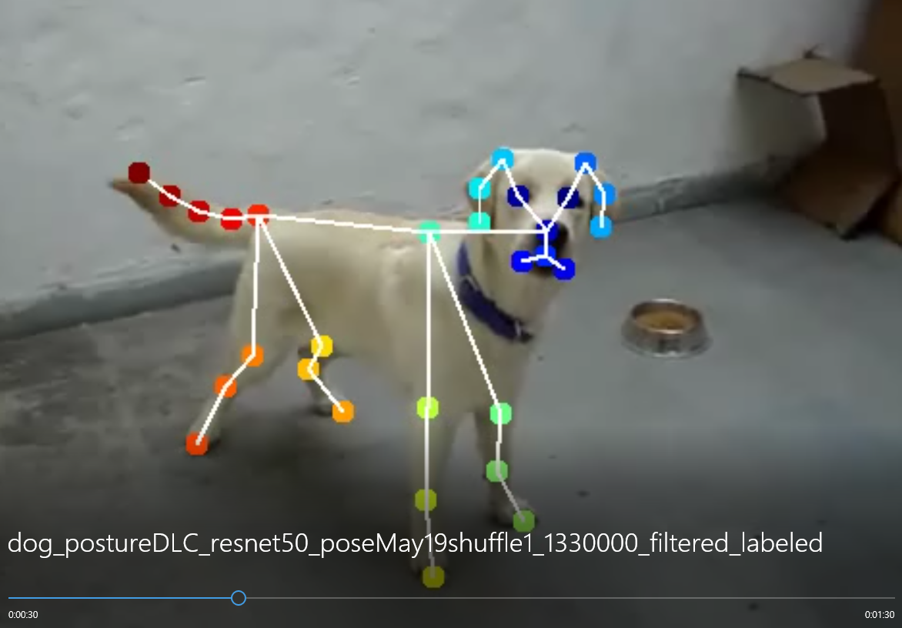

# DeepLabCut 개요 번역
<http://www.mousemotorlab.org/deeplabcut>
<https://github.com/DeepLabCut/DeepLabCut>

#### DeepLabCut : 동물 포즈 추정을 위한 소프트웨어 패키지

DeepLabCut은 3D 마커가 없는 자세 추정에 효율적인 방법을 제공한다. DeepLabCut은 멋진 결과를 달성한 *deep neural networks*에 기반한 전이학습을 가능하게 해준다. (DeepLabCut에서는 일반적으로 50~200 프레임만 있으면 최소한의 학습 데이터를 마련한 것이다).
DeepLabCut은 다양한 행동에 거쳐 다양한 종들의 다양한 바디 파트를 트랙킹할 수 있다.


DeeperCut을 사용할 때 많은 도움을 받을 수 있는 software package이다. 기존에는 영상 프레임에서 1마리에 대한 pose estimation만을 제공하였는데 이제 multi animal pose estimation에 대한 기능을 지원해준다.

---

### 얻을 수 있는 이점
1. UI 또는 래핑 된 python 코드로 프로젝트 생성부터 검증, 결과 분석까지를 제공해 주기 때문에 DeeperCut 알고리즘을 이용해서 동물의 pose estimation을 할 때 상당히 편리하다.
2. 자체 라벨링 툴을 제공해준다.
3. 모델의 추론 결과를 프레임별로 검증하면서, 신체포인트를 제대로 찍지 못한 사진을 보정하고 학습을 다시 시키는 작업을 쉽게 할 수 있다.
4. 동물 자세 추정에 가장 적합한 data augmentation 방식을 제공해줘서 적은 사진 수로도 꽤나 정확도 높은 모델을 만들어 낼 수 있다.
5. 추론 결과를 다루는 다양한 함수를 제공한다. 일정 기준으로 필터링 할 수도 있고, 좌표별로 plot 그래프를 그릴 수도 있다.


### 사용 개요
1. 먼저 형상을 받고 필요한 부분들을 설치해준다. 본인이 anaconda를 이용중이라면 매우 쉽게 설치할 수 있다. 형상을 받고 conda-environments 폴더에 들어간 뒤 conda 환경을 하나 만들어준다.
```
conda env create -f DLC-GPU.yaml  # gpu 환경에서 작업 시
```
GUI 모드로 진행해도 되고 python 환경에서 deeplabcut을 import한 뒤 코드 기반으로 진행해도 된다.
2. 프로젝트를 만들고 config파일을 원하는 방법으로 수정한다. 그 뒤 동영상을 하나 올리고 프레임을 뽑는다. 이때 프레임을 뽑는 다양한 방법을 지정할 수 있다. 그리고 자체 툴을 이용해서 라벨링을 진행한다.
3. 트레이닝을 할 때 사용할 backbone CNN 알고리즘을 선택한다. resnet과 mobilenet을 지원한다. 선택 후 트레이닝을 진행한다.
4. 트레이닝한 모델이 나오면 해당 모델에 데이터를 넣어서 추론을 한다. 그 결과를 보고 다시 라벨링 툴을 이용해 미세한 조정을 하고 다시 학습을 시킨다.
5. 그리고 이 과정을 계속 계속 반복한다.
---

### Deeplabcut 라벨링툴을 이용하지 않는다면
DeeplabCut은 본인의 라벨링 툴로 라벨링을 진행한다는 가정하에 사용법이 가이드 되고 있다. 하지만 나의 경우에는 효율성을 위하여 다른 라벨링 툴을 사용하였기 때문에 학습에 필요한 데이터 형식을 맞쳐주는데 상당히 까다로운 작업이 필요하다.

DeeplabCut에 트레이닝을 위해 준비해야하는 데이터 형식은 다음과 같은 4가지 파일이다.
1. csv
2. h5
3. pickle
4. mat

**아래의 코드에 본인의 custom dataset을 deeplabcut에서 사용하도록 만드는 코드가 포함되어 있다.**

---

### 사용 방법
먼저 밑의 코드를 이용해 프로젝트를 생성하고, 동영상 추출을 하여 config.yaml 파일을 생성하고 기본적인 데이터셋 파일들을 생성해야 한다.
```python
import deeplabcut
deeplabcut.create_new_project('ProjectName','YourName', ['/usr/FullPath/OfVideo1.avi', '/usr/FullPath/OfVideo2.avi', '/usr/FullPath/OfVideo1.avi'],
              copy_videos=True/False, multianimal=True/False)
```
그리고 생성된 프로젝트 경로에 들어가서 설정파일을 변경해준다. config.yaml 파일이 설정파일이다. 읽어보면 직관적으로 다양한 설정들을 해줄 수 있으며 나의 경우에는 bodyparts와 skeleton을 내가 원하는 형태로 바꿔 주었다.
```yaml
bodyparts:
- eye-left
- eye-right
- nose
- mouth-left
- mouth-right
- mouth-low
- tongue
- ear-left-start
- ear-left-middle
- ear-left-end
- ear-right-start
- ear-right-middle
- ear-right-end
- withers
- prosternum
- elbow-left
- forearm-left
- forefoot-left
- elbow-right
- forearm-right
- forefoot-right
- stiffle-left
- hock-left
- hindfoot-left
- stiffle-right
- hock-right
- hindfoot-right
- tail-start
- tail-start-middle
- tail-middle
- tail-middle-end
- tail-end

skeleton:
- - eye-right
  - nose
- - eye-left
  - nose
- - eye-right
  - ear-right-start
- - ear-right-start
  - ear-right-middle
- - ear-right-middle
  - ear-right-end
- - eye-left
  - ear-left-start
- - ear-left-start
  - ear-left-middle
- - ear-left-middle
  - ear-left-end
- - nose
  - mouth-low
- - mouth-low
  - mouth-right
- - mouth-low
  - mouth-left
- - mouth-low
  - tongue
- - nose
  - withers
- - nose
  - prosternum
- - withers
  - elbow-right
- - prosternum
  - elbow-right
- - elbow-right
  - forearm-right
- - forearm-right
  - forefoot-right
- - withers
  - elbow-left
- - prosternum
  - elbow-left
- - elbow-left
  - forearm-left
- - forearm-left
  - forefoot-left
- - withers
  - tail-start
- - prosternum
  - tail-start
- - tail-start
  - stiffle-right
- - stiffle-right
  - hock-right
- - hock-right
  - hindfoot-right
- - tail-start
  - stiffle-left
- - stiffle-left
  - hock-left
- - hock-left
  - hindfoot-left
- - tail-start
  - tail-start-middle
- - tail-start-middle
  - tail-middle
- - tail-middle
  - tail-middle-end
- - tail-middle-end
  - tail-end
```

config 파일을 내 입맛에 맞게 수정을 한 뒤 다음 코드를 이용해서 데이터 형식을 맞추고 트레이닝을 진행하였다.

```python
import os
os.environ['DLClight'] = "True"
os.environ["CUDA_DEVICE_ORDER"]="PCI_BUS_ID"   
os.environ["CUDA_VISIBLE_DEVICES"]="0,1"
import deeplabcut

import pandas as pd
import os
import numpy as np
import h5py

####### 고정적인 값들 ########
scorer = 'eastRain'
origin_file = 'labeled-data/origin/CollectedData_' + scorer + '_origin.h5'

####### 학습 시킬 때 변경해야 하는 변수들 #########
iteration_num = 3
train_data = '/home/eastrain/mnt/test_custom_data/0519'

####### 자동으로 완성되는 변수들(딱히 건드릴일은 없다) ##########
iteration_name = 'iteration-' + str(iteration_num)
output_file = os.path.join('labeled-data', iteration_name,'CollectedData_' + scorer + '.h5')
config_path = 'config_' + str(iteration_num) + '.yaml'

bodyparts = [
    'eye-left',
    'eye-right',
    'nose',
    'mouth-left',
    'mouth-right',
    'mouth-low',
    'tongue',
    'ear-left-start',
    'ear-left-middle',
    'ear-left-end',
    'ear-right-start',
    'ear-right-middle',
    'ear-right-end',
    'withers',
    'prosternum',
    'elbow-left',
    'forearm-left',
    'forefoot-left',
    'elbow-right',
    'forearm-right',
    'forefoot-right',
    'stiffle-left',
    'hock-left',
    'hindfoot-left',
    'stiffle-right',
    'hock-right',
    'hindfoot-right',
    'tail-start',
    'tail-start-middle',
    'tail-middle',
    'tail-middle-end',
    'tail-end'
]

nan = np.empty((1,2,))
nan[:] = np.nan
dataFrame = pd.read_hdf(origin_file,'df_with_missing')
cnt = 0
all_csv_files = []

for (path, directory, files) in os.walk(train_data):
    for filename in files:
        file_abs_path = os.path.join(path, filename)
        ext = str(os.path.splitext(file_abs_path)[1]).lower()
        if ext == '.csv':
            all_csv_files.append(str(file_abs_path))

total_cnt = len(all_csv_files)

for file in all_csv_files:
    csv = pd.read_csv(file, header=None, usecols=[0,1,2,3,4], names=['key', '1', '2', '3', '4'])
    file_name = file.split('.')[0] + '.' + csv['key'][0].split('.')[1]
    temp_df=None
    
    point_dict = {}
    for _index, item in enumerate(csv['key'][3:]):
        if item == 'eye-left-open':
            item = 'eye-left'
        elif item == 'eye-right-open':
            item = 'eye-right'        
        
        point_dict[item] = [csv['1'][3 + _index], csv['2'][3 + _index]]
    
    for bodypart in bodyparts:
        index = pd.MultiIndex.from_product([[scorer], [bodypart], ['x', 'y']],names=['scorer', 'bodyparts', 'coords'])
        
        if bodypart in point_dict:
            frame = pd.DataFrame([point_dict[bodypart]], columns = index, index = [file_name])
        else:
            frame = pd.DataFrame(nan, columns = index, index = [file_name])
        temp_df = pd.concat([temp_df, frame],axis=1)
    dataFrame = pd.concat([dataFrame, temp_df],axis=0)
    
    #for _index, item in enumerate(csv['key'][3:]):
    #    if item == 'eye-left-open':
    #        item = 'eye-left'
    #    elif item == 'eye-right-open':
    #        item = 'eye-right'        
    #    
    #    dataFrame.loc[file_name][scorer, item,'x' ] = csv['1'][3 + _index]
    #    dataFrame.loc[file_name][scorer, item,'y' ] = csv['2'][3 + _index]
        
    cnt += 1
    print(str(cnt) + " / " + str(total_cnt))


labeled_dir = os.path.join('labeled-data', iteration_name)
if not os.path.isdir(labeled_dir):
    os.mkdir(labeled_dir)
labeled_file_root = os.path.join(labeled_dir, 'CollectedData_' + scorer)
dataFrame.to_csv(labeled_file_root + '.csv')
dataFrame.to_hdf(labeled_file_root + '.h5', 'df_with_missing',format='table', mode='w')

deeplabcut.create_training_dataset(config_path)

deeplabcut.train_network(config_path, shuffle=1, displayiters=1000, saveiters=50000, max_snapshots_to_keep=10, maxiters=1330000, gputouse=0,1)
```

이 작업을 통해 학습을 진행하고 나면, 프로젝트 폴더의 dlc-models 밑에 수행한 iteration 폴더 밑에 스냅샷이 저장된다. 원하는 스냅샷을 사용하여 검증을 진행하면 된다. 하지만 어떤 스냅샷을 사용할지 결정을 못하였으면 **Evaluation**을 통하여 성능을 측정하여야 한다.

config.yaml 파일을 열어서 **snapshotindex** 부분을 찾는다. 나의 경우에는 모든 스냅샷을 eval 해보고 싶어서 all 을 입력하였다. 그 뒤 다음 코드를 통해서 evaluation을 할 수 있다.

```python
import deeplabcut

config_path = 'config.yaml'
deeplabcut.evaluate_network(config_path, plotting=False, gputouse=0,1, rescale=True)
```

해당 작업을 수행하고 evaluation-results 폴더 밑으로 가보면 h5 파일과 csv 파일이 떨어져 있는 것을 확인할 수 있다. 각 이터레이션별로 Train error(px), Test error(px), p-cutoff used, Train error with p-cutoff, Test error with p-cutoff를 확인할 수 있다.

---

또한, 만들어진 모델에 video를 넣어서 output을 뽑아보거나, plot을 뽑아보는 등 다양한 작업을 할 수 있다.

```python
file_name = 'dot_eatin'
file_type = 'mp4'
iteration = '3'
config_path = '/home/eastrain/workspace/0514/config_' + iteration +'.yaml'
target = os.path.join('/home/eastrain/workspace/0514/output/iteration-' + iteration, file_name, file_name + '.' + file_type)

deeplabcut.analyze_videos(config_path,[target], videotype='.mp4', save_as_csv = True, gputouse=0)

deeplabcut.filterpredictions(config_path,[target])

deeplabcut.analyzeskeleton(config_path, [target], videotype='.mp4', shuffle=1, trainingsetindex=0, save_as_csv=True, destfolder=None)

deeplabcut.create_labeled_video(config_path, [target], filtered=True, draw_skeleton = True)

deeplabcut.plot_trajectories(config_path,[target],filtered = True, showfigures= True)
```

---

## 학습을 돌리고 강아지의 자세를 추론한 영상의 일부 스크린샷과 plot pose 결과이다.




